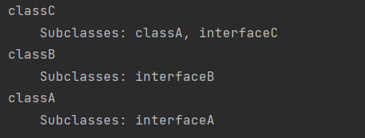
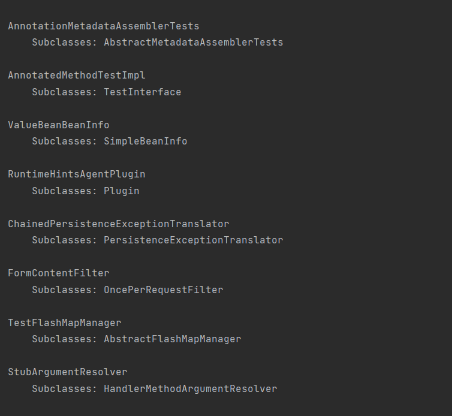
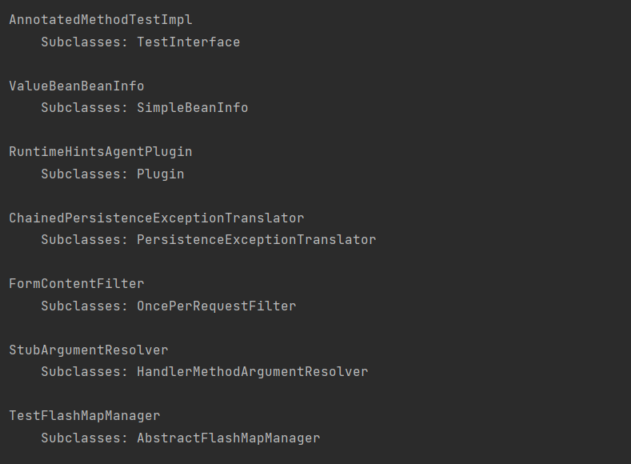
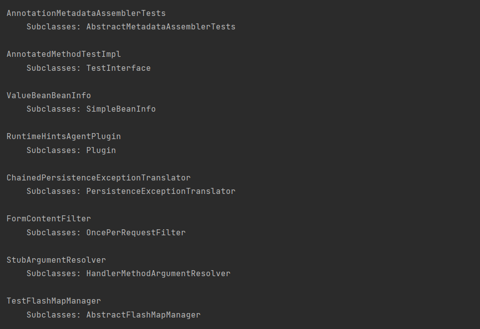

# Parallel and distributed programming:

## InheritanceIndex_2
### Task:

Write a search bot for the source code of a program.

For a Java project (a local folder), build and print to the console a reverse inheritance index of classes. For each
class, find (and print) the classes for which it serves as a base (parent) class. The keywords class, interface,
extends, and implements must be correctly processed.

It is necessary to use the Map interface and the getOrDefault() method. Using the Stream API is preferable.

### Solution:

The main logic of the program is as follows:

- The `getJavaFiles()` method receives the project directory and returns a list of files with the `.java` extension located
  inside the directory.
- The `buildInheritanceIndex()` method takes a list of Java files and analyzes each file line by line.
    - For each line of code, the method uses the regular expressions `CLASS_PATTERN` and `INTERFACE_PATTERN` to determine
      the presence of classes or interfaces in that line.
    - If a class or interface is found, the program extracts the name of the class/interface and the name of its parent,
      then adds the parent to the corresponding list of inheriting classes/interfaces in the index.
    - After analyzing all files, the method returns the constructed inheritance index.
- The `main` method serves as the program's entry point. It sets the path to the project directory and calls the
  `getJavaFiles()` and `buildInheritanceIndex()` methods to build the index. Then, it outputs the index results to the
  console. For each class/interface in the index, the method prints the class/interface name and a list of its
  inheritors/implemented interfaces to the console.

#### Regular Expression for `CLASS_PATTERN`:
`".*class\\s+(\\w+)\\s*(<.+>)?\\s*(extends\\s+(\\w+))?\\s+(implements\\s+([\\w,\\s]+)(<.+>)?)?"`

- `".*class\\s+"` - Matches any characters followed by the word "class" and one or more spaces.
- `"(\\w+)"` - Matches one or more word characters (letters, digits, or "_"), which will be captured in a group.
- `"(<.+>)?"` - An optional group that matches a string enclosed in < >, capturing it in a group (generic classes).
- `"(extends\\s+(\\w+))?"` - An optional group that matches the word "extends", followed by one or more spaces and a word, captured in a group.
- `"(implements\\s+([\\w,\\s]+)(<.+>)?)?"` - An optional group that matches the word `"implements"`, followed by one or more spaces, capturing a list of words separated by commas and/or spaces, and saving it in a group.

#### Regular Expression for `INTERFACE_PATTERN`:
`".*interface\\s+(\\w+)\\s*(<.+>)?\\s*(extends\\s+([\\w,\\s]+))?"`

- `".*interface\\s+"` - Matches any characters followed by the word "interface" and one or more spaces.
- `"(\\w+)"` - Matches one or more word characters (letters, digits, or "_"), which will be captured in a group.
- `"(<.+>)?"` - An optional group that matches a string enclosed in `< >`, capturing it in a group.
- `"(extends\\s+([\\w,\\s]+))?"` - An optional group that matches the word `"extends"`, followed by one or more spaces and a list of words separated by commas and/or spaces, which will be captured in a group.

### Results:

## InheritanceIndex_3
### Task:

Enhance the program from Task 2 so that a separate thread (`Thread`) is created for processing each source code file. No interaction between threads is required! To wait for thread completion, the `join()` method can be used, but `CountDownLatch` is preferable. The program's functionality should be demonstrated on a large GitHub project, such as the Spring Framework.

### Solution:

Main logic of the program remains similar to the previous one, except for the following changes:

- In the `main` method, declare a `CountDownLatch` with the number of threads equal to the number of `.java` files in the Spring Framework. Pass it as a parameter to the `buildInheritanceIndex()` method. After calling this method, invoke `CountDownLatch.await()` to wait for all threads to complete execution in the main thread.
- In the `buildInheritanceIndex()` method, wrap the code that processes classes/interfaces in a separate `.java` file within an individual `Thread`.

### Part of results:

## InheritanceIndex_4
### Task:

The processing of source code files must be performed in separate threads. The result should be collected into a unified index (using `Map`). Access to the unified index must be protected by a synchronization object. The main thread must wait for all threads to complete before printing the unified index to the console. The `synchronized` keyword can be used, but `ReentrantLock` is preferable.

### Solution:

The main logic of the program remains similar to the previous one, but now it is necessary to add `ReentrantLock` to lock the unified index during writing.

### Part of results:

## InheritanceIndex_5
### Task:

Unlike the program from Task 4, the number of threads must be limited. One of the Java Executor Service implementations should be used. The formation of the unified index should be done using Future. All Future objects must be collected into a list, and only after the last "task" has been submitted for processing should the results be retrieved using the get() method.

### Solution:

- To set a fixed number of threads, use `Executors.newFixedThreadPool()`.
- The `invokeAll()` method takes tasks that implement the Callable interface and returns Future objects.
- Then, call `executorService.shutdown()` to wait for all tasks to complete.
- Using the `get()` method, retrieve partial indexes and merge them into a unified index.

### Part of results:

## InheritanceIndex_6
### Task:

The main thread must "assign tasks" for processing source code files to worker threads. The number of worker threads is fixed. Tasks and the unified index should be stored in a Blocking Queue. The main thread must wait for the execution of all assigned tasks before printing the unified index to the console.

It is necessary to create two queues and a fixed number of threads; the main thread sends "tasks" to the first queue; worker threads process the tasks and place the results into the second queue; the main thread retrieves results from the second queue. Threads can remain running or be terminated using a poison pill.

### Solution:

- Create a Runnable class that takes the task queue and the result queue as arguments. In `run()`, use an infinite `while` loop where the task queue calls `take()`, which waits for a new task, processes the index, and then places the result into the result queue. The poison pill can be implemented by intentionally placing a nonexistent file path into the queue as a termination signal.
- To wait for all tasks to complete, create a separate thread for monitoring the result queue and call `join()`.
- Then, place tasks into the queue using `put()`, which waits until space is available (by calling `take()`). Finally, insert a poison pill into each worker thread’s queue to terminate them.

### Part of results:
